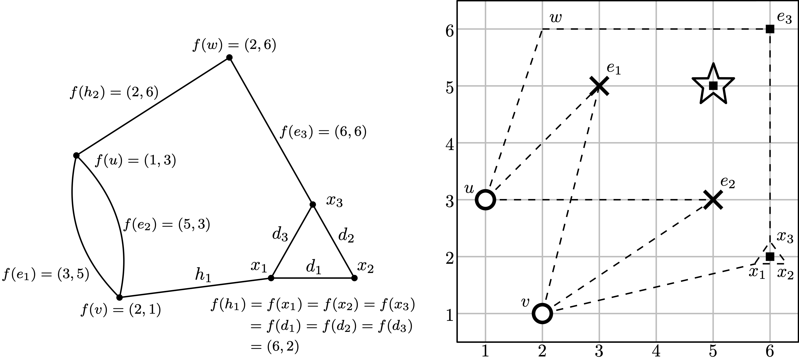

# graph-mph0
This is a project about computing absolute betti numbers at dimension 0 for a bi-filtered graph based on [Computing Betti tables and minimal presentations of zero-dimensional persistent homology](https://arxiv.org/abs/2410.22242). 

## User Guide 
### Install 
Clone the repo along with all submodules
```shell
git clone git@github.com:YuanL12/graph-mph0.git
cd graph-mph0/
git submodule update --init --recursive
```

In your local repository, build this C++ project
```Shell
mkdir build && cd build
cmake ..
make -j4
```
then you will have the executable `main`.

Install the Python package `graph_mph` if you want to run the notebooks under `tutorial` folder.
```Shell
pip install pybind11 # this is necessary 
pip install .
```
Uninstall if you don't want to use our package anymore
```bash
pip uninstall graph_mph
```

If you prefer to use uv, here is a full installation command lines that has been tested working on a linux machine 
```bash
uv venv --python 3.13
source .venv/bin/activate
uv pip install ipykernel matplotlib
uv pip install .
``` 
That's all you need to run the Jupyter notebook `compute_mph_firep.ipynb` under tutorial folder. 

### Input
We support the following two types of input
1. a point cloud
2. a bifiltration in the format of `firep`:
```bash
firep
first parameter
second parameter
#_of_edges #_of_vertices 0 
grade_x_of_e_0 grade_y_of_e_0 ; boundary_vertex_0_of_e0 boundary_vertex_1_of_e0
...
grade_x_of_v_0 grade_y_of_v_0 ;
...
```
### Output 
- `b_0`: $\beta_0(H_0)$
- `b_1`: $\beta_1(H_0)$
- `b_2`: $\beta_2(H_0)$
- `b_0_1`: $\beta_0(H_1)$
- `M`: minimal presentation--a list of triples (i, j, v) representing value v at at row i and column j, where i represents the ith element of `b_0` and j represents the jth element of `b_1` (1-indexed). 


### Example
Consider the bifiltered graph


There are 8 edges and 6 vertices, so the forth line of our `.firep` file is `8 6 0`. Next, for each edge, we specify its grade and then two boundary vertices. After that, list the grades of vertices. Note that the edge boundary indices should follow the vertex order. 

```bash
firep
first parameter
second parameter
8 6 0
3 5 ; 0 1 
5 3 ; 0 1 
6 6 ; 2 5
6 2 ; 1 3
2 6 ; 0 2
6 2 ; 3 4 
6 2 ; 4 5
6 2 ; 3 5
1 3 ; 
2 1 ; 
2 6 ;
6 2 ;
6 2 ;
6 2 ;
```

Our package will first collect all grade points and sort the x and y coordinates into two lists:
```
x coordinates: xs = [1, 2, 3, 5, 6]
y coordinates: ys = [1, 2, 3, 5, 6]
```

The output results stored in a dict use the indices of the above coordinates: 
```Python
{'b_0': [(0, 2), (1, 0)],
 'b_1': [(2, 3), (3, 2)],
 'b_2': [(3, 3)],
 'b_0_1': [(3, 3), (4, 1), (4, 4)],
 'M': [(1, 1, -1), (2, 1, 1), (1, 2, -1), (2, 2, 1)]}
```

This tells us that two connected components are born at $(x[0],y[2]) = (1,3)$ and $(x[1],y[0]) = (2,1)$ from `b_0`, and they merge at $(x[2], y[3])$ and $(x[3], y[2])$ from `b_1`. `b_2` tells us that one of the two elements of `b_1` is redundant at $(x[3],y[3])$. These information can also be retrieved in $M$. 

Additionally, `b_0_1` tells us the birth time of $H_1$.

## Citation
To be added